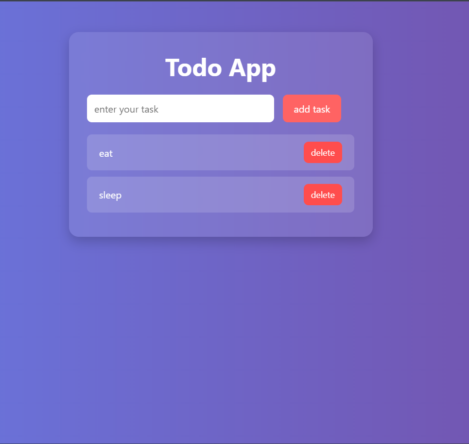

---

## 💡 How to Use

1. go to this http://abhi12072003singh.github.io/to-do-app/ or
1. Clone or download the repository
2. Open `index.html` in a browser.
3. Type a task in the input box.
4. Press **Enter** or click **Add Task**.
5. Click the **Delete** button to remove a task.

---

## 🖼️ UI Preview

---

## 🛠️ Tech Stack

- HTML5
- CSS3 (with glassmorphism effects)
- JavaScript (Vanilla)

---

## 📌 Future Improvements

- Add "Edit Task" feature
- Mark tasks as completed (with strikethrough)
- Save tasks to Local Storage
- Filter tasks (All / Active / Completed)

---

## 📃 License

This project is open-source and free to use.

---

Made with ❤️ by Abhinav Singh
